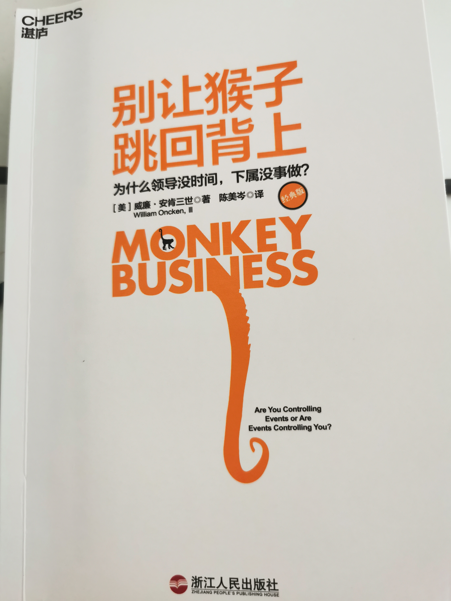

# 《别让猴子跳回背上》

第一章：源源不断的猴子

管理者的贡献来自于他们的判断力与影响力，而非他们个人投入的时间长短与埋头苦干的程度。    --P003

消除“往上指派的工作”（upward delegation）

任务层级/自由层级：

* （5）独立行动，例行性报告（最高层级）
* （4）行动，但需立即请示（意味着报告频率超过例行程度）
* （3）提出建议，按照裁断的结果行动
* （2）请示要做什么
* （1）等待指示（最低层级）

## 第二章：你是猴子磁场吗？

解决他的问题，让你可以从自己的问题中抽身出来放一天假。    -P018

> 为了逃避自己的问题，而去做那些自己已经非常熟练掌握的工作；这种现象实际上非常普遍，包括自己也经常会有这样的情况。
>
> 把时间用来做真正有价值的工作，实在是太难了。

管理逆向，犹如金字塔被倒转过来，由下属来监督管理者。    -P021

