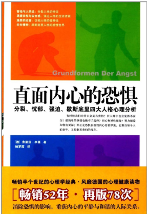

# 《直面内心的恐惧》

认识自己才能改变自己，才能让自己变得更好，知道了现象和原因，就能有针对性地寻找解决办法。

2019-06-10：

目前读到第四部分了。基本上每一种人格，自己都或多或少地能对应上。既感到害怕，又感到开心。害怕是担心自己的问题太严重，k开心是知道了自己的问题所在，也知道这些问题很普遍。

读这本书还有一个收获：自己花费了很多年思索的结论，只是他人思考和总结的小片段而已，这方面的内容早已形成了丰富的理论体系，自己学习一下就可以认识和解决自己的问题。如何充分利用前人的工作成果，而不是自己从零开始，显得十分的重要！

2019-06-27：

童年的经历真的对后期的影响很大，而且这种影响是根深蒂固的，强大到甚至自己都感觉不到这种影响的存在。回顾自己的成长历程，发现自己性格、心理、思想方面的特征及其可能的来源，对于后续的成长非常重要。蜕变从真正正确认识自己开始！

2019-08-18：

人是真的很容易荒废，这本书也看了好几个月了，已经看到第四部分了，但硬是没有看完。生活的琐事，时间的碎片化，偷懒等等，不一而足。

还记得大学时候某个老师说的：这个时间点应该努力学习，等长大后有了家庭，有了工作，再要学习就没这么好的条件了。现在想想，这绝对是肺腑之言。

