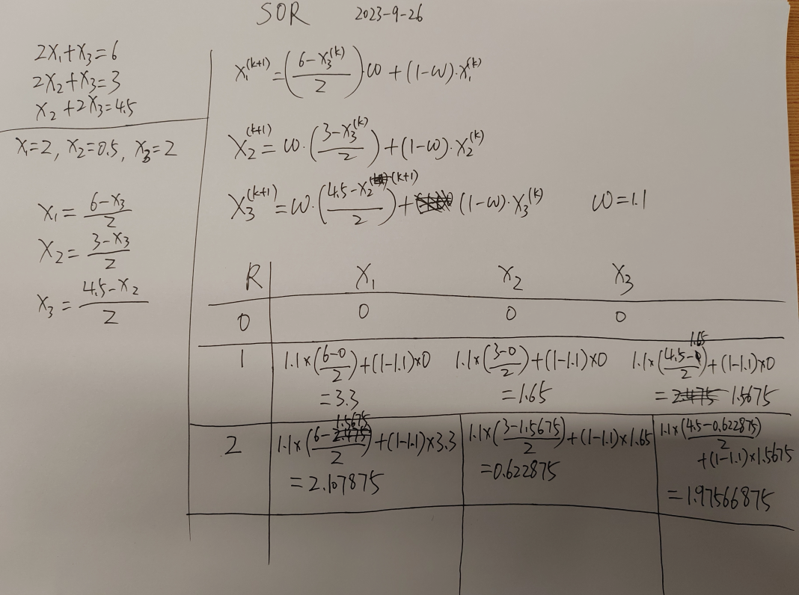

# successive over relaxation method（SOR）学习一例

背景：在阅读经典著作《Parallel and Distributed Computation: Numerical Methods》一书时，有提到relaxation method，特意学习一下

最初的信息来源：[https://zhuanlan.zhihu.com/p/25099638](https://zhuanlan.zhihu.com/p/25099638)

原书相关信息地址：[http://www.mit.edu/\~jnt/parallel.html](http://www.mit.edu/\~jnt/parallel.html)

参考youtube视频：[https://www.youtube.com/watch?v=D3S185K4WWc](https://www.youtube.com/watch?v=D3S185K4WWc)

参考python代码：[https://www.codesansar.com/numerical-methods/python-program-successive-over-relaxation.htm](https://www.codesansar.com/numerical-methods/python-program-successive-over-relaxation.htm)

看了上面文章和视频之后，自己手动演算了一次：

<figure><figcaption>
SOR-手动演算示例
</figcaption></figure>

手动演算对真正理解非常有帮助，一定要自己亲自做一遍，我就在手动演算的过程中发现自己对什么时候用k+1以及k没有理解到位，演算结果出现了错误，马上重新理解+改正

