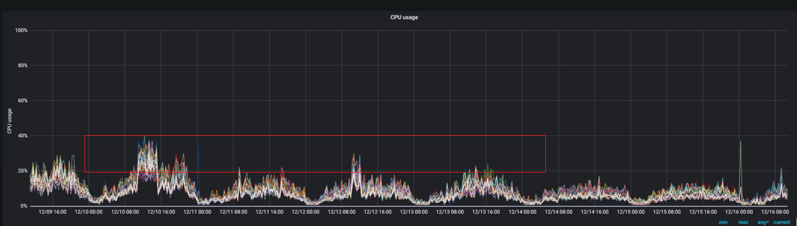
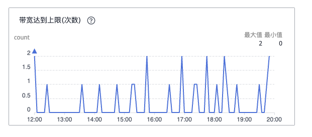

# 【列表】重要技术工作项目日志

## ES集群深入数据有效性进行优化

时间：2019年1月-2019年3月

背景：某功能es集群容量持续增长，已占用40+台机器，急需扩容

思考：扩容相对来讲比较被动，不能发挥运维人员的主观能动性，无法体现出团队的价值

尝试分析：数据存储的合理性

* lbs索引里面，province和city为0的记录是没有任何意义的，可以清理掉。
* active/online索引里面，timestamp超过一定范围的，都是没有意义的数据，可以清理掉。
* 修改业务逻辑，避免产生新的无效数据。

效果一：lbs数据总共约100亿条，清理无效数据31.5亿条，占比30%。

效果二：确定active/online索引只保存180天的数据，定时删除老索引


> 简评：
>
> 这项优化根本都还没有涉及到技术上的优化，就实现了30%的优化效果。
>
> 技术是做事的条件之一，但是绝对不是有了技术就能把事情做好的；在没有理清楚业务的逻辑及使用情况下，一味地强调技术只能是事倍功半。
>
> 技术需要为业务服务，而运维在中间能够很好地当做技术与业务的沟通和桥梁作用。
>
> 运维即熟悉业务又熟悉技术，能够很好地发挥自己的作用。

## 广播缓存历史非活跃uid数据清理

时间：2019年2月-2019年3月

背景：广播缓存是用来对某一个APP的所有用户发送消息的一个模块，里面存储了该APP下全部用户的UID信息。

现象：广播缓存占用内存空间持续增长，使用的是redis的set结构；广播缓存模块启用后数据只增不减，但实际上里面有很多是不活跃的僵尸用户，合理地清理掉这些用户，对于节约内存空间、提高查询效率都非常有帮助。

> 简评：
>
> 业务总是希望能有足够多的资源可以供他们使用，最好是永远都用不完的资源，但实际上不存在这样的条件，不光是技术上的问题，成本上也不可接受。业务运维需要和业务方强调这一理念，并推动业务侧在使用方式上做出合理的优化。
>
> 如果业务说：我也不清楚哪些数据可以删除。
>
> 那么我回答：你不知道不代表你不应该知道，这是你应该要知道的；如果你现在不知道，那就要想办法弄清楚。

## CouchBase热点数据导致集群踢出节点

时间：2019年1月-2019年2月

现象：一个由8个节点组成的CouchBase集群，发现总是频繁地出现某一节点突然被自动踢出集群，然后另一机器CPU负载超高的现象，导致整个集群响应非常慢。一段时间内改现象反复出现。

排查：替换过机器、重建过集群，问题还是重复出现。基本排除硬件和软件bug的问题。

定位：发现是一个用户针对某个uid（在CouchBase中是key）做压力测试，发送大量消息，一次压测能发送数百万条消息；该uid是虚拟uid，峰值达到3w-4w/s的写入量；CB是根据key来hash到节点的，一个key自然是映射到了一个节点上，从而导致某个节点过热，进而被踢出集群。当第一个节点被踢出集群后，由于副本集设置为1，CouchBase的安全机制确保不会再自动踢掉第二个节点，所以导致另一个节点CPU占用超高，进而导致整个集群几乎不可用。

解决：在业务逻辑处做判断，当请求量达到一定程度时，做服务降级处理，丢弃部分数据。

> 简评：
>
> 对业务使用的具体情况，再加上对技术工具的原理的理解，才能最终彻底解决问题。

## 某ES集群优化

时间：2019年3月

现象：4台机器组成的ES集群，业务侧反馈**查询非常慢**，但是看机器监控压力都很小。

查找和解决：客户端连接的线程池设置为200，而我们的服务器是16核的，过大的线程池数量导致查询效率低下。通过修改线程池大小，线程数不超过25： 查询不要超过25，写入不要超过 16。业务侧做了上述修改之后，再无类似的问题出现。

## 基于KVM和OpenStack下虚拟机CPU超分导致的性能问题

时间：2019年7月

OpenStack集群下，某台物理机分配有多个VM，两倍多地超分了CPU资源，即使某一个VM的CPU是空闲的，也会引起整个物理机上其他VM的CPU出现steal的情况。把空闲的VM所分配的CPU数量降下去之后，其他VM的CPU性能也有了明显的改善。

整个物理机是48个核心（实际上只有24个物理核，开启HT技术后显示有48核），所有VM整体超分到60+虚拟CPU，其中有一个MySQL的备库分了16个vCPU，但是实际压力很小；另外一个MQ的虚拟机是8核，但是出现了超过16%的steal。最开始查找问题的时候，并没有怀疑到这个MySQL的备库（因为它本身的压力确实非常小），查了一圈之后，尝试将这个备库关机，发现MQ的性能一下子就好了。

另有一例：某天快下班的时候，为了准备一台机器做紧急情况备用，从OpenStack集群中申请了一台空闲的虚拟机（“虚拟机A”）。该虚拟机未运行任何有效负载，只是处于开机状态。

结果晚上，有一个CouchBase集群出现异常，排查发现，是该CouchBase集群有一台虚拟机“虚拟机B”和新申请的“虚拟机A”处于同一台物理机上，“虚拟机B”自从“虚拟机A”申请下来之后，监控系统看到持续出现CPU steal。怀疑和新申请的“虚拟机A”有关系。

将新申请的“虚拟机A”释放之后，“虚拟机B”恢复正常，同步整个CouchBase集群也恢复正常。

## PIka和Sentinel性能问题一例

时间：2019年8月

背景：一套注册用的Pika集群，配置是5主5从，每个实例大约占用600G空间以及大约150亿的数据量。

现象：访问Pika的代理大量报超时（业务侧设置的是10s超时时长）。

怀疑一：SSD磁盘写放大导致的性能下降。经排查是有可能的，但是不会突然出现，初步否定。

怀疑二：业务量突然增长。经排查否定。

最终，通过查看Pika的slowlog发现了很多INFO命令超时（Pika默认设置的是slowlog时间是20ms），很多都在200ms-700ms之间。

再查看延迟开始发生的时间点，发现那个时间添加了5台sentinel，初步怀疑是Pika的INFO指令效率不高，导致sentinel的INFO指令消耗了太多资源导致。

临时解决方案：将5台sentinel减少到3台，观察一段时间，确实没有类似的报警再出现了。

原理研究：Pika 2.3.2版本的INFO指令，每次请求都要重新扫描、获取一次数据，在数据量比较大的情况下会产生较大的延迟；5台Sentinel的加入，因为Sentinel需要频繁地和Pika实例进行通讯，导致Pika整体性能大幅度下降。

后期优化方案：

1、推动Pika的版本升级工作，Pika 3.x的版本对底层引擎做了大幅度优化。

2、手动修改Pika 2.3.2版本的INFO指令工作方式，每5秒钟（或每10秒）后台更新一次数据并写入内存，每次接受INFO指令的时候直接从内存返回数据即可，大幅度提升效率。

## pfadd与expire导致redis的OPS过高

时间：2019年8月

背景：122主+122复制集，总共244个节点组成的redis cluster；用来做数据的实时统计，有大量的HyperLogLog写入请求。

现象：每天redis cluster的expire指令能执行18万亿次（你没有看错，我也没有打错，是十八万亿次），整个集群在白天高峰期的最高OPS达到瓶颈（大约300万OPS），导致业务侧有延迟，影响运行速度和工作效率。

分析：整个key space实际上只有三个亿，之所以有18万亿次请求，是因为一天内同一个数据会更新很多次；如果针对一个key，只更设置一次expire，就能大幅度减少expire的指令数量。

优化方案一：

通过Lua脚本将pfadd和expire两个指令合并成一个，并通过判断KEY是否存在来决定是否设置expire；只有当KEY不存在的时候才设置expire。

该方案会引入新的EVAL和EXISTS指令，性能未必能比以前好，而且维护相对复杂（因为涉及到Lua脚本）。

优化方案二：

维护一个缓存区队列（计划是kafka或者另一个redis实例），将半小时内的KEY写入并去重，然后每半小时对这个缓存区的所有KEY集中设置一次expire。

该方案能大幅减少expire的次数，但是存在一个问题：如果某个KEY因为某种原因（比如缓存区丢失）没能设置expire，则会永久地存在在redis Cluster里面，日积月累可能会有很多脏数据。

优化方案三：

在业务进程内维护一个缓存区（在进程内存空间中，不超过200MB，使用LRU算法），只有当KEY不存在于这个缓存区的时候才去设置expire，理论上可以大幅度降低执行expire的指令，而且也不用担心有KEY会永久停留在redis Cluster中。

## Nginx代理与后端服务器连接数限制引起性能抖动

时间：2019年8月

现象：nginx->backend引起流量波动，CPU负载升高，nginx的statsu状态数据明显异常

排查：nginx的错误日志明显上升，发现很多连不上后端，无法建立连接。

可能原因：nginx作为客户端与backend的连接，受到TCP四元组以及TIME\_WAIT释放的限制，导致新建连接被拒绝。

优化方案：

1、增加后端数量，由VIP的主从模式变成两个后端同时工作的upstream模式，增加后端容量。

2、修改nginx代理与后端的连接配置，增加keepalive配置，将与后端的短连接变成长连接，减少重复建立连接的开销，也可以避免连接数过多。

## 历史消息ES集群优化索引的mapping节省磁盘空间和CPU资源

时间：2019年12月-2020年1月

现象：历史消息记录量持续上升，每天超过5T的磁盘空间，持续的扩容导致资源紧张

优化：分析索引的mapping，一个一个字段进行优化，包括是否需要分词、字段类型等

效果和收益：每日磁盘空间从5.3T下降到3.5T，下降34%；CPU利用率从40%下降到25%，下降37%

ES版本：2.3.5（还没有text和keyword）参考文档：[https://www.elastic.co/guide/en/elasticsearch/reference/2.3/mapping-index.html](https://www.elastic.co/guide/en/elasticsearch/reference/2.3/mapping-index.html)

应用新mapping具体时间：2019年12月10日（20191211索引生效）

索引优化具体内容（带 ---> 就是前后的变化）：

```
{
  "20191206": {
    "mappings": {
      "ik_v1": {
        "_all": {
          "analyzer": "ik_max_word"
        },
        "properties": {
          "api_type": {
            "type": "long"  ---> integer
          },
          "appkey": {
            "type": "string",
            "index": "not_analyzed"
          },
          "errno": {
            "type": "long"   ---> integer
          },
          "itime": {
            "type": "long"
          },
          "json_string": {
            "type": "string"  --->不需要分词和索引，增加 "index": "no"
          },
          "msg_content": {
            "type": "string",
            "boost": 8,
            "analyzer": "ik_max_word",
            "include_in_all": true
          },
          "msg_id": {
            "type": "long"
          },
          "msg_type": {
            "type": "long"  ---> integer
          },
          "platform": {
            "type": "string"
          },
          "receiver_type": {
            "type": "long"  ---> integer
          },
          "receiver_value": {
            "type": "string",
            "boost": 8,
            "analyzer": "ik_max_word",
            "include_in_all": true
          },
          "send_source": {
            "type": "long"  ---> integer
          },
          "total_user": {
            "type": "long"
          }
        }
      }
    }
  }
}
```

优化效果：

磁盘空间：单天的索引占用磁盘大小从5.3T下降到3.5T，下降34%


CPU利用率：从峰值的40%下降到峰值的25%左右，下降37%




## 使用redis-shake对redis集群进行数据拷贝报错

时间：2024年5月

现象：团队近期需要对两套redis-cluster进行迁移，一套约100G大小，另一套约200G大小，主实例数量在10-30个之间。用redis-shake工具进行迁移，迁移到中途会报错退出，尝试几次还是一样的情况。

```
12:11:14 [PANIC] read error, please check source redis log or network
[error]: EOF
[stack]: 
    1   /Users/tongyao.lty/Work/RedisShake/src/redis-shake/common/utils.go:930
            redis-shake/common.Iocopy
    0   /Users/tongyao.lty/Work/RedisShake/src/redis-shake/dbSync/syncBegin.go:92
            redis-shake/dbSync.(*DbSyncer).runIncrementalSync
        ... ...
```

搜索得到如下建议：

<figure><figcaption></figcaption></figure>

<figure><figcaption></figcaption></figure>

看FAQ文档：[https://github.com/tair-opensource/RedisShake/wiki/redis%E2%80%90shake-2.x-%E5%B8%B8%E8%A7%81%E9%97%AE%E9%A2%98](https://github.com/tair-opensource/RedisShake/wiki/redis%E2%80%90shake-2.x-%E5%B8%B8%E8%A7%81%E9%97%AE%E9%A2%98)

<figure><figcaption></figcaption></figure>

优化：为了避免修改参数引起其他不必要的问题，我们尝试“在业务低峰期再进行同步”，果然就顺利完成了同步了。


## redis因磁盘吞吐性能不足，导致业务访问请求超时

时间：2024年5月

现象：研发侧反馈，6台业务机器，在访问某个redis实例时，偶尔会出现链接超时的现象，一天也就出现那么七八次

排查：经过全面排查，发现redis实例所在的机器，在业务反馈的时间点，吞吐量均有突增的现象；怀疑与磁盘相关，进而怀疑与AOF相关，可能与AOF rewrite相关。为确定，临时把AOF关闭，相关现象确实就彻底消失了，基本确定是磁盘吞吐性能不足导致的。

<figure><figcaption><p>从云磁盘后台的监控可以看到带宽达到上限</p></figcaption></figure>

从Prometheus监控也可以看到，磁盘吞吐量达到了133MB/s，达到该“高IO”磁盘的上限（吞吐量 = min (150, 100 + 0.15 × 容量（GiB）)）。

<figure><figcaption><p>从Prometheus查看：磁盘写入峰值带宽到达133MB/s</p></figcaption></figure>

优化：升级磁盘规格，从“高IO”直接升级到“超高IO”，满足性能需求。

因磁盘空间是200GB，所以“高IO”硬盘的吞吐性能是130MB/s（吞吐量 = min (150, 100 + 0.15 × 容量（GiB）)）；升级到“超高IO”后，磁盘的吞吐性能提升到220MB/s（吞吐量 = min (350, 120 + 0.5 × 容量（GiB）)）

<figure><figcaption><p>云硬盘的IO吞吐量性能数据</p></figcaption></figure>

