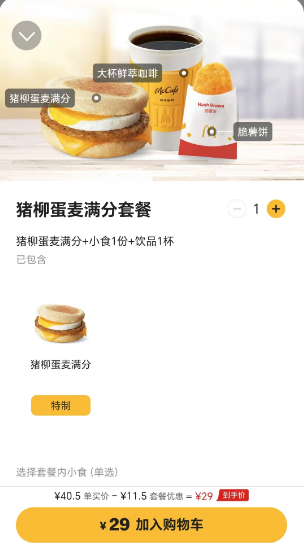

# 有感于麦当劳早餐的定价策略

麦当劳有个月付的早餐卡（11.9元/30天 或 19.8元/60天），购买之后，很多早餐套餐可以打六折。比如猪柳蛋麦满分套餐，包含一个猪柳蛋麦满分、一个脆薯饼、一杯鲜萃咖啡，在早餐卡的加持下，**到店取餐**的场景下只需要15元人民币（¥36.5 单买价-￥11.5 套餐优惠-￥10 早餐卡优惠=¥15）。但是如果选择**外送**，则无法享受这个10元的优惠，甚至连套餐的单买价格都变高了，需要支付29元人民币（¥40.5 单买价 -￥11.5 套餐优惠=¥29）。

<figure><figcaption>
<mark style="color:green;"><strong>1、到店取餐的价格</strong></mark>
</figcaption></figure>

<figure><figcaption>
<mark style="color:green;"><strong>2、选择外送的价格</strong></mark>
</figcaption></figure>

这里实际上就有一个很明显的问题：**到店取餐**和**外送**，对于商家来说，制作这个套餐有成本上的区别么？实际上更像是拿捏了这些选择**外送**的客户，就是认定他们因为各种原因会愿意支付更高的价格，比如他们没有时间到店取餐。
